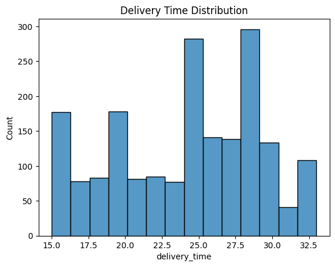

# 🍔 FoodHub Business Analytics Project

Project Overview

FoodHub is a food delivery platform that connects customers with restaurants through online ordering services.

This project analyzes customer ordering behavior, restaurant performance, delivery efficiency, and customer satisfaction to generate actionable business recommendations.

⸻

Business Problem

FoodHub wanted to better understand:

•⁠  ⁠Customer ordering patterns
•⁠  ⁠Popular cuisines and restaurants
•⁠  ⁠Delivery performance
•⁠  ⁠Customer ratings and satisfaction
•⁠  ⁠Revenue opportunities

⸻

Tools Used

•⁠  ⁠Python
•⁠  ⁠Pandas
•⁠  ⁠NumPy
•⁠  ⁠Matplotlib
•⁠  ⁠Seaborn
•⁠  ⁠Exploratory Data Analysis (EDA)
•⁠  ⁠Data Visualization

⸻

Methodology

Exploratory Data Analysis

•⁠  ⁠Order volume analysis
•⁠  ⁠Cuisine popularity analysis
•⁠  ⁠Restaurant performance analysis
•⁠  ⁠Delivery time analysis
•⁠  ⁠Customer rating analysis

Business Analysis

•⁠  ⁠Customer behavior patterns
•⁠  ⁠Revenue analysis
•⁠  ⁠Operational performance evaluation
•⁠  ⁠Customer satisfaction assessment

⸻
## Key Visualizations

### Top Cuisine Types

### Delivery Time Distribution

Key Findings

Customer Preferences

American, Japanese, and Italian cuisines were among the most frequently ordered food categories.

Restaurant Performance

A relatively small number of restaurants generated a significant portion of total orders.

Customer Satisfaction

Highly rated restaurants tended to receive more repeat business and customer engagement.

Delivery Operations

Delivery times varied significantly and represent an opportunity for operational improvement.

⸻

Business Recommendations

1.⁠ ⁠Strengthen partnerships with top-performing restaurants.
2.⁠ ⁠Improve delivery efficiency during peak demand periods.
3.⁠ ⁠Promote high-rated restaurants to increase customer satisfaction.
4.⁠ ⁠Develop targeted marketing campaigns based on customer preferences.

⸻

Author

Yen See Chen

Master of Financial Engineering (USC)

Specialize in Financial Analytics Engineering, Financial Consulting, and Machine Learning Engineering.
